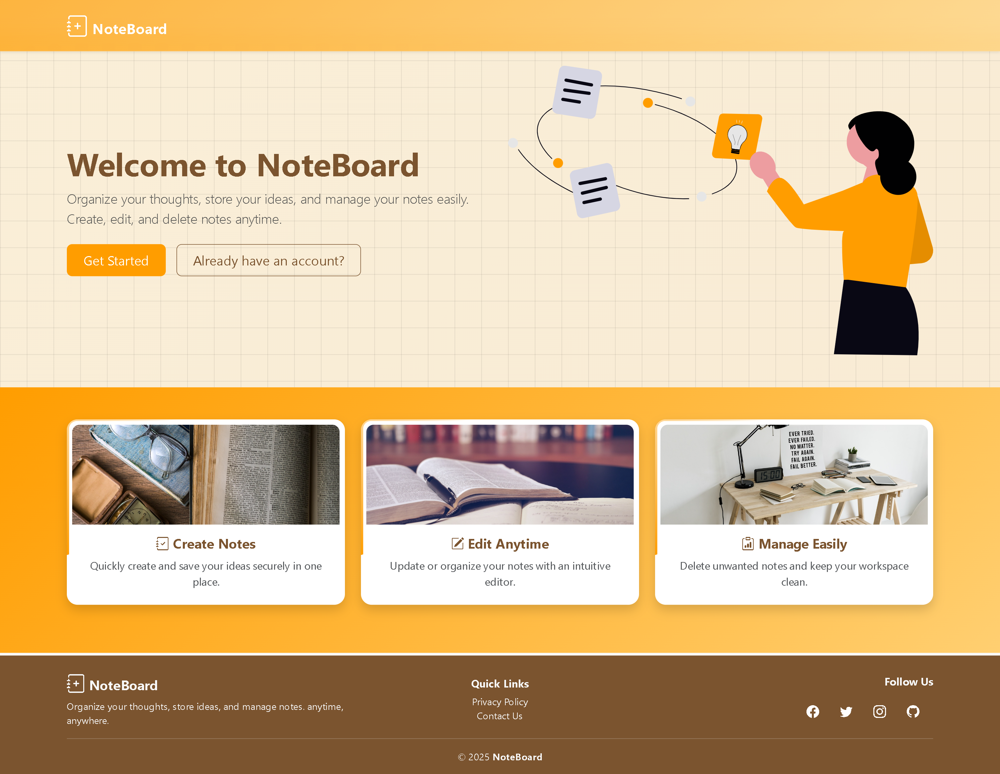

# NoteBoard - Django Notes Management Web App

A sleek, responsive notes management web application built with Django and Bootstrap 5. Create, edit, and organize your notes with ease using this modern web app.

<p align="center">
  
</p>


## Features

- ✨ **User Authentication** - Secure registration and login system
- 📝 **CRUD Operations** - Create, Read, Update, Delete notes
- 🎨 **Modern UI** - Bootstrap 5 with responsive design
- 🔍 **Search Functionality** - Find notes quickly
- 🗑️ **Soft Delete** - Notes can be restored if needed
- 📱 **Mobile Friendly** - Responsive design for all devices
- ⚡ **Class-Based Views** - Clean, maintainable code structure

## Tech Stack

- **Backend**: Django 5.2.7
- **Database**: PostgreSQL
- **Frontend**: Bootstrap 5, JavaScript
- **Authentication**: Django Auth System
- **Icons**: Bootstrap Icons

## Installation

### Prerequisites

- Python 3.8+
- PostgreSQL
- pip (Python package manager)

### Step 1: Clone the Repository

```bash
git clone https://github.com/yourusername/noteboard.git
cd noteboard
```

### Step 2: Create Virtual Environment

```bash
# On Windows
python -m venv env
env\Scripts\activate

# On macOS/Linux
python3 -m venv env
source env/bin/activate
```

### Step 3: Install Dependencies

```bash
pip install -r requirements.txt
```

### Step 4: Configure environment variables
  - Create a new `.env` file in the backend folder.  
  - Copy the contents of `.env.example` into `.env`.  
  - Update the placeholder values with your actual local configuration (e.g., `SECRET_KEY`, `DEBUG`, `DATABASE_URL`, `REDIS_URL`, etc.).

### Step 5: Run Migrations 

```bash
python manage.py makemigrations
python manage.py migrate
```

### Step 6: Create Superuser

```bash
python manage.py createsuperuser
```
### Step 8: Run Development Server

```bash
python manage.py runserver
```
---

**Happy Coding!** 

May your code be bug-free, your designs be pixel-perfect, and your coffee be ever-flowing! ☕

---

